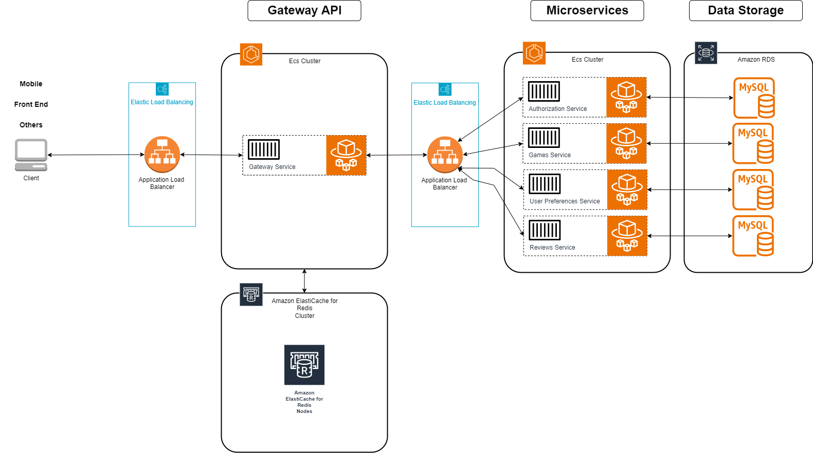

# Game-Discovery-on-Cloud-AWS
The whole system architecture was made to pass the "Cloud Computing" exam for the computer science master's degree at "La Sapienza" - University of Rome.
 It was implemented using Spring Boot with microservices pattern, Swagger technology (SpringDoc), WebClient, Hibernate, Redis Cache, MySQL DB, Docker and AWS.
  This repository contains all the projects (microservices and GatewayAPI) implementations, DB scripts and also test implementation part (Python_Locust) that was used directly to test the services on AWS.

 More details about the architecture and deployment can be read on the <a href="/Game Discovery Report.pdf">Game Discovery Report</a>.

# AWS Deployment Diagram

# How to use
The projects must be downloaded separately under 'Games Discovery' folder.
There you can find all the java classes, pom.xml, Dockerfile, yml, DB scripts to generate DB and some optional initial values.

NOTE: the YML files use environment variables, so you must put a value for each by yourselve to be able to run the projects.
